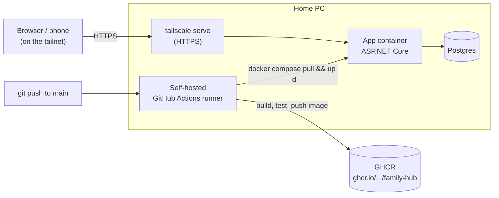
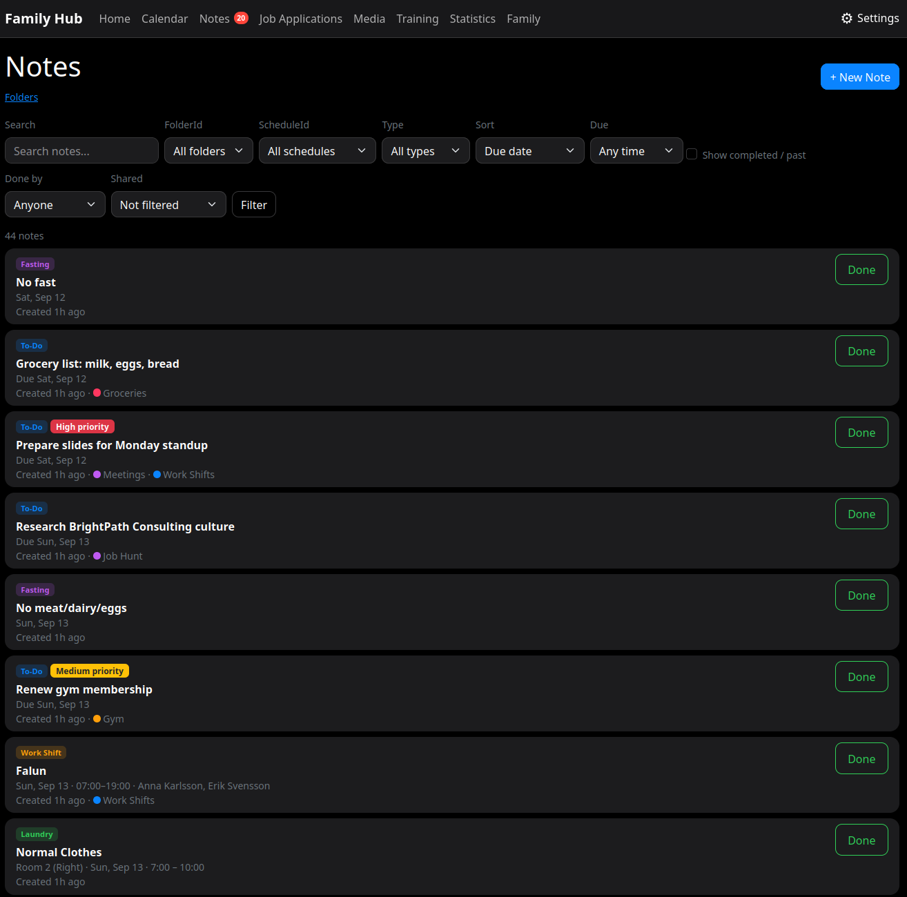
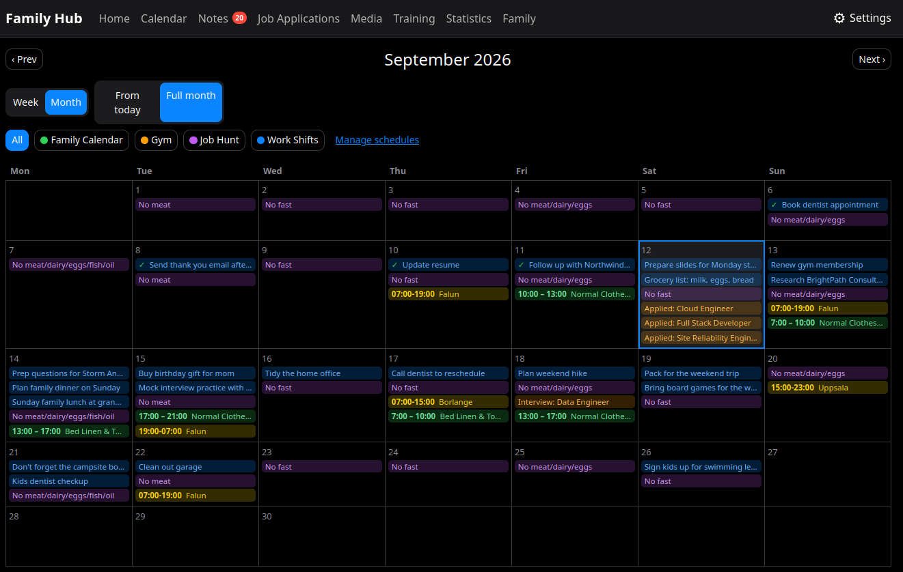

# Family Hub

[](https://github.com/AlbinKlintman/family-hub/actions/workflows/ci-cd.yml)


A self-hosted personal web app for tracking the small stuff that matters day
to day — job applications, notes, a shared calendar, and training — with
each account seeing only its own data. Runs on a home server, reachable from
anywhere over Tailscale, with a full CI/CD pipeline deploying every push.

## Features

- **Job Applications** — a Trello-style drag-and-drop kanban board across
  seven stages (Searching → Applied → Test Scheduled → Test Done → Interview
  Scheduled → Interview Done → Rejected), with companies you can attach to
  an application, a chance rating, an applied date that sets itself
  automatically the first time an application reaches "Applied," and
  multiple free-form descriptions and links per application. Searchable by
  role, company, description text, or link.
- **Notes** — to-dos, laundry scheduling, work shifts, and Eastern Orthodox
  fasting-level tracking, organized into nested, color-coded folders with a
  priority level per note. Work shifts carry a start/end time, a location,
  and up to 4 colleagues (a small entity of their own, picked from a list).
  Fasting entries can be added one at a time or painted across a whole
  month at once from a dedicated bulk calendar view. To-dos can recur on a
  custom interval and carry any number of configurable reminders. Sortable,
  filterable by due date or type, and searchable by title/location.
- **Schedules** — user-defined, colored calendar categories (e.g. "Work",
  "Fasting"). Any note or job application can be tagged with one directly,
  and any folder can be linked to one so everything filed there shows up
  under it too. The Calendar page can filter down to a single schedule.
- **Calendar** — a shared events calendar with full month/week views plus
  rolling week/month views that start from today, filterable by schedule.
- **Training** — workout logging, weight tracking, and exercise history.
- **Statistics** — charts over the training data.
- **Reminders** — a background service posts a Discord notification 24
  hours and 1 hour before a to-do or job interview is due (laundry gets a
  24-hour heads-up only, since it's scheduled by time-of-day window rather
  than an exact time).
- **Dashboard** — the home page surfaces notes due soon, applications in
  progress with the next upcoming interview, and the next 7 days of
  calendar events, all in one place.
- **Notification badge** — a live count of what's overdue or due today
  (open notes plus job applications whose interview date has passed
  without the card being moved to Interview Done), shown as a red circle
  in the navbar everywhere, and pushed to the app icon itself via the
  Badging API on platforms that support it (Chromium desktop/Android, and
  iOS 16.4+ home-screen web apps).
- **Light/dark theme** — a toggle in the navbar, remembered per browser.
- **Installable (PWA)** — a web app manifest and service worker let you
  install Family Hub as a standalone app (own icon, no browser chrome) on
  desktop or mobile, with static assets cached for faster loads and a small
  offline page if the connection drops. Pages themselves are always fetched
  fresh from the network, never cached, since this is a per-user dynamic app.

Every account is fully isolated — no user can see or reach another user's
data, enforced on every query and tested explicitly (cross-user id access
returns 404, a forged cross-user API request is rejected).

## Stack

- ASP.NET Core (Razor Pages) on .NET 10, with ASP.NET Core Identity for auth
- EF Core + PostgreSQL (Npgsql)
- Bootstrap 5 + vanilla JS (SortableJS for the kanban drag-and-drop) — no
  frontend framework, everything vendored locally rather than pulled from a
  CDN
- Docker + Docker Compose
- MailKit for transactional email (account confirmation) over SMTP
- Serilog for structured JSON console logging
- ASP.NET Core's built-in rate limiter on login/register
- A `/health` endpoint backed by a database connectivity check

## Architecture



- **Self-hosted**, on an always-on home PC, reachable remotely only over
  [Tailscale](https://tailscale.com/) via `tailscale serve` — no public
  ports are opened on the home network. SSH access is key-only, password
  auth disabled.
- **CI/CD**: GitHub Actions, with the runner installed *on the same server*
  (as a persistent user-level `systemd` service) rather than a GitHub-hosted
  runner reaching in over SSH. A push to `main` runs the test suite, builds
  and pushes a versioned image to GitHub Container Registry, then the deploy
  step is just a local `docker compose pull && up -d` — no deploy keys ever
  leave the machine. The workflow only triggers on `push`, deliberately not
  `pull_request`, since this is a public repo with a self-hosted runner.
- **Backups**: Postgres is dumped and copied to a second machine over
  Tailscale on a schedule (`scripts/backup.sh` + a systemd timer checking
  every few hours), but only actually runs when enough time has passed
  *and* the second machine happens to be online — otherwise it's a no-op
  and waits for the next check. Keeps the 3 most recent copies.

## Local development

```bash
# Postgres connection string (kept out of git — see appsettings.json for the shape)
dotnet user-secrets set "ConnectionStrings:DefaultConnection" "Host=localhost;Port=5432;Database=familyhub;Username=familyhub;Password=..."
dotnet user-secrets set "Email:Password" "..."
dotnet user-secrets set "Notifications:DiscordWebhookUrl" "..."   # optional -- reminders just log a warning and no-op without it

docker compose up -d db   # Postgres only, published on 127.0.0.1:5432
dotnet run
```

Or run the whole stack containerized (copy `.env.example` to `.env` first
and fill in real values):

```bash
docker compose up -d --build
```

Once running, `/health` reports whether the app can reach the database.

### Tests

```bash
dotnet test WebApp.slnx
```

Includes both fast in-process unit tests (EF Core InMemory) and end-to-end
integration tests (`WebApp.Tests/Integration/`) that spin up a real,
ephemeral Postgres container via [Testcontainers](https://testcontainers.com/)
and drive the app through real HTTP requests — registration, email
confirmation, login, and CRUD flows. Docker must be running locally for
those to pass; the same self-hosted CI runner that builds and deploys the
app already has it.

## Repo layout

- `Pages/` — Razor Pages, one folder per feature area
- `Models/` — EF Core entities
- `WebApp.Tests/` — xUnit test project (`Integration/` for the
  Testcontainers-backed end-to-end tests)
- `scripts/` — operational scripts (backup) and their systemd unit files
- `docs/` — runbooks (e.g. migrating the server role to a new machine)

## Screenshots

_Coming soon — drop images into `docs/screenshots/` and reference them here,
e.g.:_

```markdown



```
